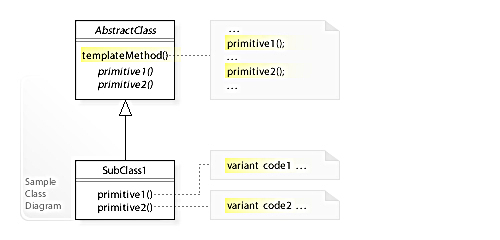

# Template Method

## 背景?
+ 在软件构建过程中, 对于某一项任务, 它常常有```稳定的```整体操作结构, 但是各个子步骤却有很多```改变的```需求, 或者由于固有的原因(比如```框架与应用```之间的关系)而无法和任务的整体结构同时实现
+ 如何在```确定稳定操作结构```的前提下, 来灵活应对各个子步骤的```变化```或者```晚期实现```需求

## 模式定义
定义一个操作中的算法的骨架(```稳定```), 而将一些步骤延迟(```变化```)到子类中. Template Method使得子类可以不改变(```复用```)一个算法的结构即可重定义(```override```)该算法的某些```特定步骤```

## UML图

